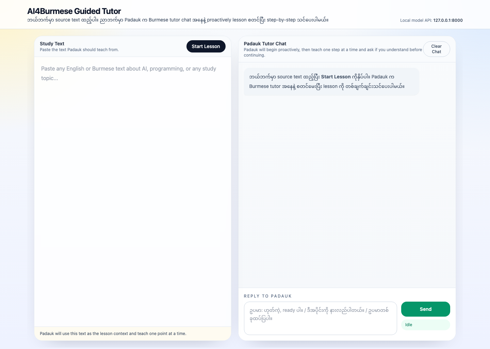

# burmese_tutor


`burmese_tutor` is a Burmese-first personalized learning app by AI4Burmese. It provides Burmese-native tutoring, multilingual support, a fine-tuned agentic learning flow, and an on-device small LLM experience in a lightweight local web app.

Developed by Dr. Wai Yan Nyein Naing.

## Features

- Personalized lesson flow grounded in the learner's pasted source text
- Burmese-native tutoring with multilingual support
- Fine-tuned agentic tutor for step-by-step teaching
- On-device small LLM workflow powered by [`ai4burmese`](https://pypi.org/project/ai4burmese/)
- Streaming local chat UI

## How AI4Burmese Powers It

[`ai4burmese`](https://pypi.org/project/ai4burmese/) provides the Burmese-first runtime used to download the local model, start the local server at `http://127.0.0.1:8000/v1`, and power the tutor app.

## App Screenshot



## Quick Setup

```bash
cd ai4burmese_app
chmod +x install_and_run.sh
./install_and_run.sh
```

Then open [http://127.0.0.1:5000](http://127.0.0.1:5000).
